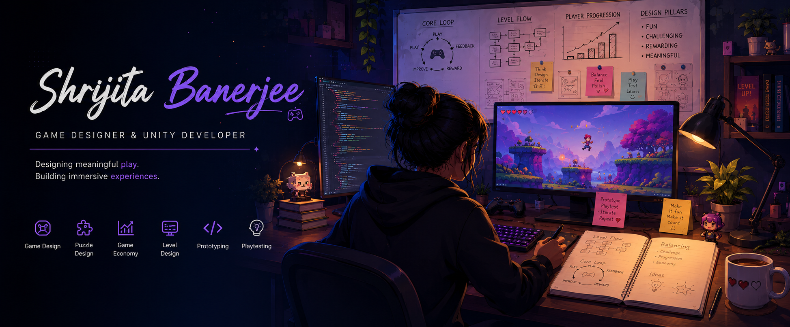

  

    

<h2 align="center">🎮 About Me</h2>
<table>
<tr>
<td width="65%">

- 🎓 BS in Data Science & Applications, IIT Madras
- 🎓 BSc in Computer Science, University of Calcutta
- 🎮 Game Designer & Unity Developer
- 🧩 Passionate about Puzzle, Hybrid Casual & Simulation Games
- 🌱 Plan to learn something new everyday
- 🚀 Looking for opportunities as a Junior Game Designer

</td>

<td width="35%">

</td>
</tr>
</table>

<h2 align="center">🛠 Tech Stack</h2>

  

Unity • C# • Git • GitHub • VS Code • Visual Studio • Java • Python • Figma • Photoshop • Notion

<!--
**shrijitasb/shrijitasb** is a ✨ _special_ ✨ repository because its `README.md` (this file) appears on your GitHub profile.

Here are some ideas to get you started:

- 🔭 I’m currently working on ...
- 🌱 I’m currently learning ...
- 👯 I’m looking to collaborate on ...
- 🤔 I’m looking for help with ...
- 💬 Ask me about ...
- 📫 How to reach me: ...
- 😄 Pronouns: ...
- ⚡ Fun fact: ...
-->
